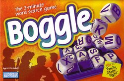

Boggle
======

[Boggle](http://images.google.com/images?q=boggle) is a letter game edited by Parker. The players must find as many words as they can in a 4×4 letters grid (or more) in three minutes. See the [official rules](http://www.centralconnector.com/GAMES/boggle.html).

For example: try to find as many French words as you can in the following grid (there are 42!):

    S H I A A
    I O S E H
    I L A R G
    H T K A A
    I E A N A

Here is a script that allows to create and resolve grids of any size. It comes with a 128970 words French dictionary. Even with such a big dictionary, the script car solve 50×50 grids in 13 seconds on a PowerBook 1.5 GHz.

#### en français
- [jouer en ligne](http://boggle.cluscrive.com/)

#### in English
- [online Boggle solver](http://www.circlemud.org/~jelson/software/netboggle.pl)
- [online multi-player boggle game](http://weboggle.shackworks.com/)
